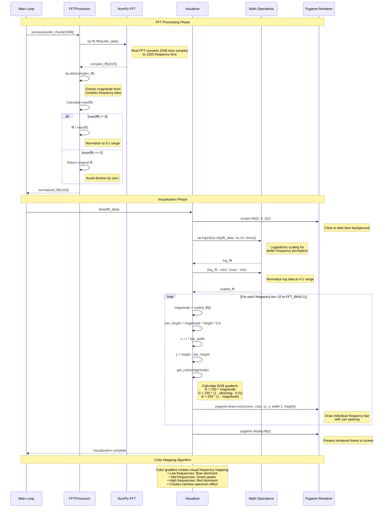

# UML Sequence Diagram: FFT Processing and Visualization Pipeline

This sequence diagram focuses on the detailed FFT processing and visualization rendering pipeline.

## Key Processing Steps:

### FFT Algorithm Flow:
1. **Real FFT Transform**: Converts 2048 time-domain samples to 1025 frequency bins
2. **Magnitude Extraction**: Converts complex numbers to magnitude values
3. **Normalization**: Scales data to 0-1 range for consistent visualization

### Visualization Pipeline:
1. **Logarithmic Scaling**: Improves perception of frequency dynamics
2. **Screen Clearing**: Prepares canvas for new frame
3. **Bar Calculation**: Maps frequency magnitude to visual bar height
4. **Color Mapping**: Creates spectral color gradient
5. **Rendering**: Draws individual frequency bars
6. **Display Update**: Presents completed frame

### Mathematical Transformations:
- **Time to Frequency Domain**: `np.fft.rfft()` 
- **Logarithmic Perception**: `np.log10()` for human-like frequency hearing
- **Dynamic Range Compression**: Normalization for consistent display
- **Spatial Mapping**: Frequency bins to screen pixel coordinates
