# UML Sequence Diagram: Real-Time Audio Processing with Mood Detection (Phase 2)

This sequence diagram shows the enhanced flow including mood detection capabilities in VibeScope Phase 2.

```mermaid
sequenceDiagram
    participant Main as Main Application
    participant Audio as AudioInput
    participant FFT as FFTProcessor
    participant Mood as MoodDetector
    participant Strategy as MoodStrategy
    participant UI as Visualizer
    participant Pygame as Pygame Events
    participant Hardware as Audio Hardware

    Note over Main, Hardware: Application Initialization (Phase 2)
    Main->>Audio: new AudioInput()
    Audio->>Hardware: Initialize stream (44.1kHz, 2048 buffer)
    Hardware-->>Audio: Stream ready
    Audio->>Audio: stream.start()
    
    Main->>FFT: new FFTProcessor()
    Main->>Mood: new MoodDetector(VolumeStrategy())
    Mood->>Strategy: Initialize strategy
    Main->>UI: new Visualizer()
    UI->>UI: pygame.init()
    UI->>UI: create display (1024x600)

    Note over Main, Hardware: Real-Time Processing Loop with Mood Analysis
    loop Main Processing Loop (30 FPS)
        Main->>Audio: get_audio_chunk()
        Audio->>Hardware: stream.read(BUFFER_SIZE)
        Hardware-->>Audio: audio_data[2048 samples]
        Audio->>Audio: flatten() & calculate level
        Audio->>Audio: print debug visualization
        Audio-->>Main: audio_chunk (numpy array)
        
        Main->>FFT: process(audio_chunk)
        FFT->>FFT: np.fft.rfft(audio_data)
        FFT->>FFT: normalize magnitude
        FFT-->>Main: fft_data (frequency spectrum)
        
        Note over Main, Strategy: Phase 2: Mood Detection
        Main->>Mood: analyze(fft_data)
        Mood->>Strategy: detect_mood(fft_data)
        
        alt Volume Strategy Active
            Strategy->>Strategy: calculate mean amplitude
            Strategy->>Strategy: compare to thresholds (0.3, 0.7)
            Strategy-->>Mood: "Calm" | "Chill" | "Hype"
        else Frequency Strategy Active
            Strategy->>Strategy: split into low/high frequencies
            Strategy->>Strategy: calculate energy ratio
            Strategy-->>Mood: "Mellow" | "Balanced" | "Energetic"
        else Spectral Strategy Active
            Strategy->>Strategy: calculate spectral centroid
            Strategy->>Strategy: calculate spectral rolloff
            Strategy->>Strategy: calculate spectral flux
            Strategy-->>Mood: "Bright" | "Deep" | "Dynamic" | etc.
        end
        
        Mood->>Mood: update mood history
        Mood->>Mood: calculate confidence
        Mood-->>Main: current_mood
        
        alt Display Mood (every 30 frames)
            Main->>Main: print mood, confidence, dominant mood
        end
        
        Main->>UI: draw(fft_data)
        UI->>UI: clear screen (fill black/blue)
        UI->>UI: apply logarithmic scaling
        
        loop For each frequency bin (1024 bins)
            UI->>UI: calculate bar height from magnitude
            UI->>UI: get_color(magnitude) - gradient mapping
            UI->>UI: pygame.draw.rect() - draw frequency bar
        end
        
        UI->>UI: pygame.display.flip()
        
        Main->>Pygame: pygame.event.get()
        alt User closes window
            Pygame-->>Main: QUIT event
            Main->>Main: running = False
        else Strategy switch requested
            alt V key pressed
                Pygame-->>Main: KEY_V event
                Main->>Mood: set_strategy(VolumeStrategy())
                Main->>Main: print "Switched to Volume-based"
            else F key pressed
                Pygame-->>Main: KEY_F event
                Main->>Mood: set_strategy(FrequencyStrategy())
                Main->>Main: print "Switched to Frequency-based"
            else S key pressed
                Pygame-->>Main: KEY_S event
                Main->>Mood: set_strategy(SpectralStrategy())
                Main->>Main: print "Switched to Spectral analysis"
            end
        else Continue processing
            Pygame-->>Main: No significant events
        end
        
        Main->>UI: clock.tick(FPS) - maintain 30 FPS
    end

    Note over Main, Hardware: Application Cleanup
    Main->>Audio: close()
    Audio->>Hardware: stream.stop()
    Audio->>Hardware: stream.close()
    Main->>UI: quit()
    UI->>UI: pygame.quit()
```

## Phase 2 Enhancements Explained:

### New Mood Detection Pipeline:
1. **Strategy Pattern**: Pluggable mood detection algorithms
2. **Real-time Analysis**: Mood detection integrated into main processing loop
3. **Multiple Strategies**: Volume, Frequency, and Spectral analysis approaches
4. **Dynamic Switching**: User can change strategies via keyboard controls
5. **Confidence Tracking**: System tracks mood detection reliability
6. **History Management**: Maintains recent mood readings for stability

### Strategy-Specific Processing:
- **Volume Strategy**: Simple amplitude-based mood classification
- **Frequency Strategy**: Low vs high frequency energy analysis
- **Spectral Strategy**: Advanced spectral feature extraction and analysis

### Enhanced User Interaction:
- **V/F/S Keys**: Real-time strategy switching
- **Console Feedback**: Mood information displayed every second
- **Confidence Metrics**: Reliability indicators for mood detection

### Performance Impact:
- **Minimal Overhead**: Mood detection adds < 1ms per frame
- **Maintained Frame Rate**: Still achieves target 30 FPS
- **Memory Efficient**: Small memory footprint for history tracking
