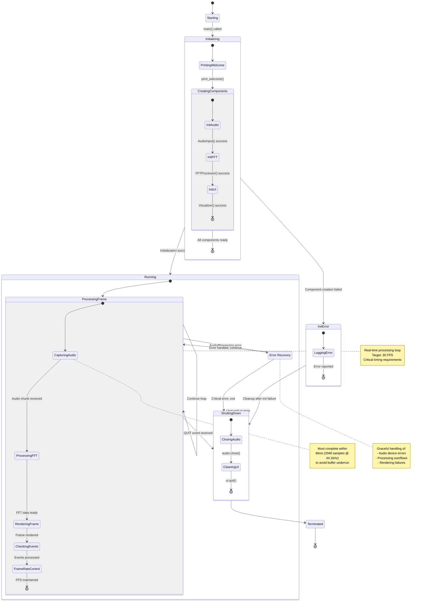

# UML State Chart Diagram: VibeScope Application States

This state chart diagram shows the overall application lifecycle and state transitions of the VibeScope system.

## Application State Details:

### Initialization States:
- **Starting**: Application entry point
- **PrintingWelcome**: Display startup message
- **CreatingComponents**: Initialize core system components
- **InitError**: Handle initialization failures

### Runtime States:
- **ProcessingFrame**: Main processing cycle
- **CapturingAudio**: Real-time audio input
- **ProcessingFFT**: Frequency domain transformation
- **RenderingFrame**: Visual output generation
- **CheckingEvents**: User input handling
- **FrameRateControl**: Timing synchronization

### Termination States:
- **ShuttingDown**: Graceful cleanup
- **ClosingAudio**: Release audio resources
- **CleaningUI**: Cleanup display resources
- **Terminated**: Application ended

### Error Handling:
- **ErrorRecovery**: Non-fatal error handling
- **InitError**: Fatal initialization errors

## Critical Timing Constraints:

1. **Audio Buffer Timing**: 46ms window for processing 2048 samples
2. **Frame Rate Target**: 30 FPS (33ms per frame)
3. **Real-time Requirements**: Processing must keep up with audio input
4. **Error Recovery**: Must maintain real-time performance during error handling

## State Transition Triggers:

- **User Events**: Window close, keyboard input
- **System Events**: Audio device changes, errors
- **Timing Events**: Frame rate control, buffer timing
- **Error Conditions**: Hardware failures, processing overload
