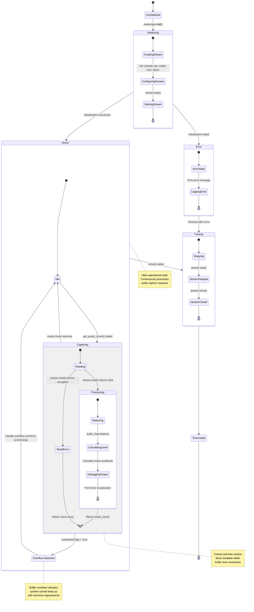

# UML State Chart Diagram: AudioInput Component States

This state chart diagram shows the various states and transitions of the AudioInput component during its lifecycle.

## State Descriptions:

### Primary States:
- **Uninitialized**: Component not yet created
- **Initializing**: Setting up audio stream with hardware
- **Active**: Normal operation, ready to capture audio
- **Closing**: Cleaning up resources
- **Terminated**: Component fully shut down
- **Error**: Error condition requiring cleanup

### Active Sub-states:
- **Idle**: Waiting for audio capture request
- **Capturing**: Actively reading from audio stream
- **Processing**: Converting and preparing audio data
- **Overflow**: Handling buffer overflow conditions

### Critical Transitions:
1. **Initialization Success/Failure**: Determines if component can operate
2. **Capture Request**: Triggers real-time audio reading
3. **Overflow Detection**: Indicates performance issues
4. **Error Handling**: Ensures graceful degradation
5. **Cleanup**: Proper resource management on shutdown
